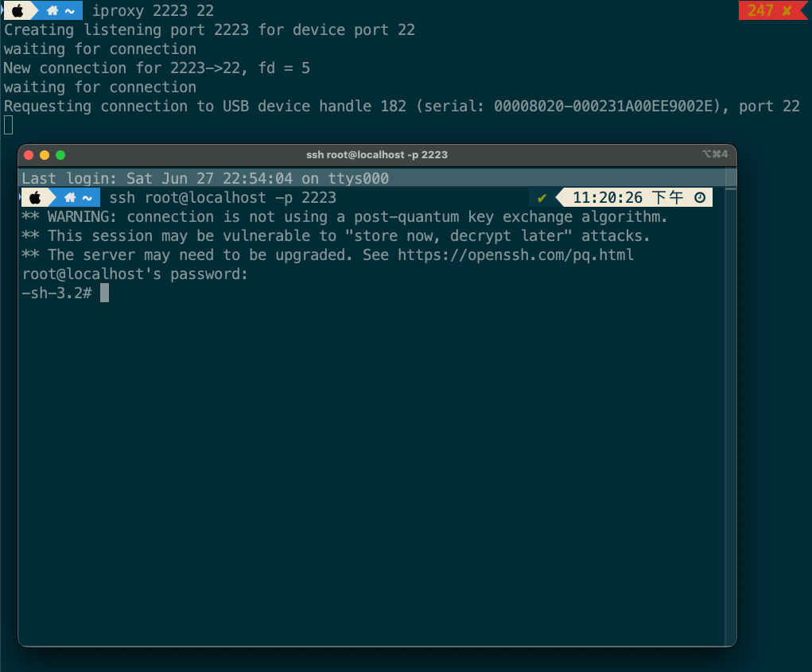

# iPhone XR Ramdisk Boot / iPhone XR Ramdisk 启动工具

脚本还不算完善，欢迎提交 PR 补充 payload 或适配更多设备。如果这个项目对你有帮助，欢迎点个 Star。

用于在 iPhone XR 上启动自定义 ramdisk，并通过 usbmux / SSH 进入 shell。

利用基础来自 [prdgmshift/usbliter8](https://github.com/prdgmshift/usbliter8)。`tools/usbliter8ctl` 用于从 pwned DFU 启动 `payload/iBSS.raw`，随后 `exploit.sh` 通过 `irecovery` 发送固件、DeviceTree、ramdisk、trustcache 和 kernelcache。



## 支持目标 / Supported Target

- 设备 / Device: iPhone XR
- Board: `n841ap`
- 启动流程 / Boot flow: pwned DFU -> iBSS -> Recovery -> ramdisk boot -> SSH

替换 payload 时，请保持文件名一致，或同步修改 `exploit.sh`。

## 硬件要求 / Hardware Required

- PR2350-A 开发板
- PR2350-A 开发板 USB 连接线
- iPhone XR USB 连接线
- macOS 或 Linux 主机

运行脚本前，先用 PR2350-A 配合 usbliter8 流程让设备进入 pwned DFU。

## 软件依赖 / Software Required

主机需要安装：

- `python3`
- Python 包：`pyusb`
- `irecovery`
- `iproxy`
- `idevice_id`
- `sshpass`
- OpenSSH 客户端：`ssh`

macOS + Homebrew 可参考：

```bash
brew install libirecovery libimobiledevice usbmuxd sshpass
python3 -m pip install pyusb
```

如果系统不允许全局安装 Python 包，可以使用虚拟环境：

```bash
python3 -m venv .venv
source .venv/bin/activate
python3 -m pip install pyusb
```

## 文件结构 / Files

```text
exploit.sh                 主启动脚本 / Main ramdisk boot script
ssh_connect.sh             SSH 重连脚本 / Reconnect to SSH after boot
tools/usbliter8ctl         基于 usbliter8 USB 流程的本地 helper
payload/iBSS.raw           从 pwned DFU 加载的 raw iBSS
payload/*.img4             Firmware、DeviceTree、ramdisk、trustcache、kernelcache
assets/ssh-ramdisk.png     SSH 成功连接截图 / Example SSH session screenshot
```

## 使用方法 / Usage

1. 安装依赖。

2. 连接 PR2350-A 开发板和 iPhone XR。

3. 使用 PR2350-A / usbliter8 流程让 iPhone XR 进入 pwned DFU。

4. 在项目目录运行：

```bash
chmod +x exploit.sh ssh_connect.sh tools/usbliter8ctl
./exploit.sh
```

脚本会自动完成：

- 创建 `logs/`
- 检查必需 payload 文件
- 启动 `payload/iBSS.raw`
- 等待设备进入 Recovery
- 发送 firmware 镜像
- 发送 DeviceTree、ramdisk、trustcache、kernelcache
- 设置 boot-args
- 执行 `bootx`
- 启动本地 `iproxy 2222 22`
- 尝试以 `root` 登录 ramdisk SSH

默认 SSH 密码：

```text
alpine
```

设备启动后，可以随时用下面的脚本重连 SSH：

```bash
./ssh_connect.sh
```

也可以手动连接：

```bash
iproxy 2222 22
ssh root@localhost -p 2222
```

## 环境变量覆盖 / Environment Overrides

如果你的工具不在默认 PATH，或想指定自定义路径，可以使用环境变量：

```bash
IRECOVERY=/path/to/irecovery \
PYTHON=/path/to/python3 \
USBLITER8CTL=tools/usbliter8ctl \
IPROXY=/path/to/iproxy \
SSHPASS=/path/to/sshpass \
./exploit.sh
```

## 常见问题 / Troubleshooting

如果 `usbliter8ctl` 提示设备不是 pwned 状态，请重新执行 PR2350-A pwned DFU 步骤。

如果脚本等待 Recovery 超时，请重新插拔 USB，并再次执行 pwned DFU 步骤。

如果 SSH 无法连接，等待几秒后运行：

```bash
./ssh_connect.sh
```

如果本地 `2222` 端口被占用，可以停止旧的 `iproxy`：

```bash
pkill -f 'iproxy .*2222.*22'
```

## 致谢 / Credits

本项目基于 [prdgmshift/usbliter8](https://github.com/prdgmshift/usbliter8)。

感谢 usbliter8 作者公开 A12/A13 SecureROM exploit 研究。

## 免责声明 / Disclaimer

本仓库仅用于安全研究、设备恢复研究，以及你拥有或已获得授权的设备。请在遵守当地法律法规的前提下使用。
